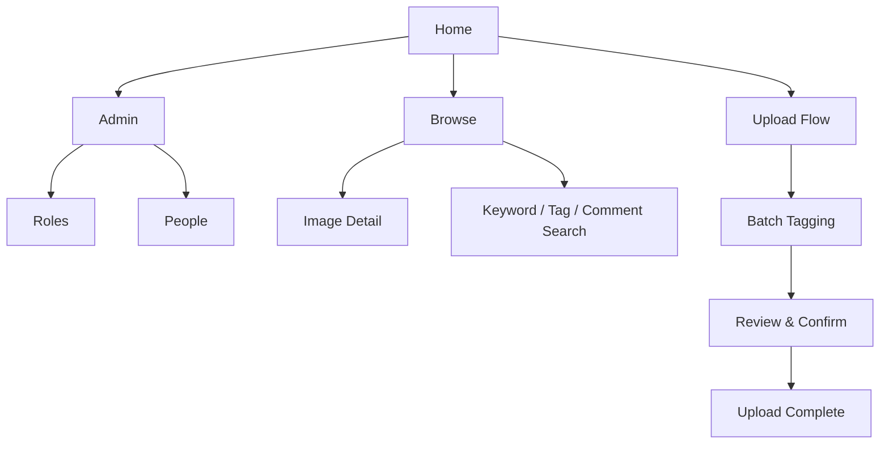
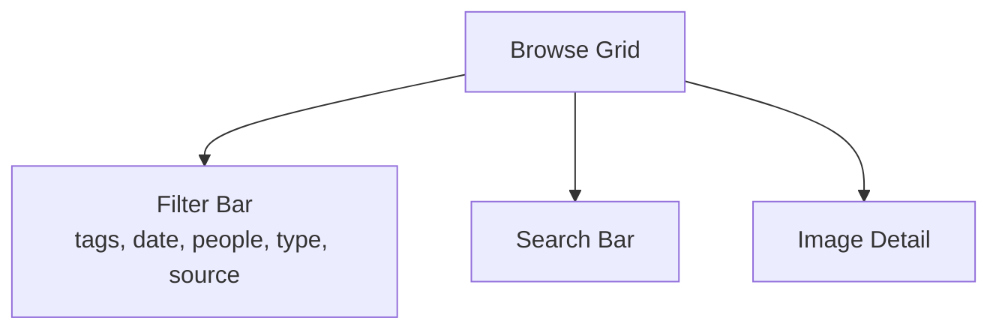
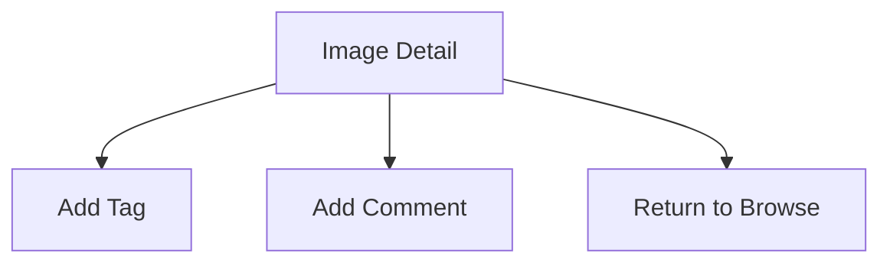
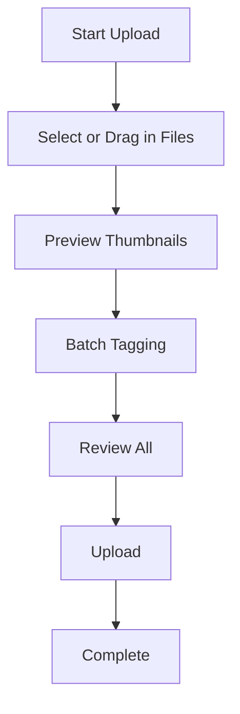
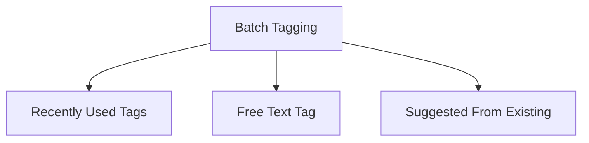
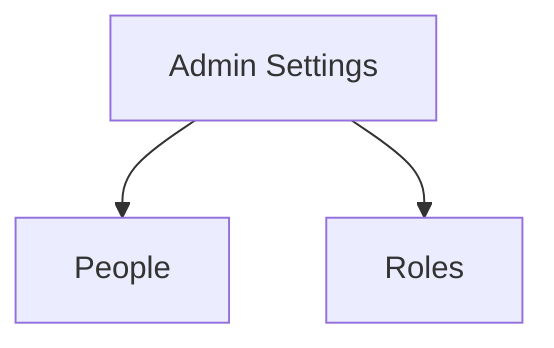

# UI Flows

This document describes the user flows for the first version of the Image Management System.  
The goal is to keep the experience simple, clear and friendly for both admins and casual viewers.

Version one focuses on browsing, simple search, uploading, and batch tagging.

---

## Table of contents
1. [High-level navigation](#1-high-level-navigation)
2. [Home](#2-home)
3. [Browse flow](#3-browse-flow)
4. [Image detail flow](#4-image-detail-flow)
5. [Upload flow](#5-upload-flow)
6. [Batch tagging flow](#6-batch-tagging-flow)
7. [Admin settings](#7-admin-settings)  

V1 Notes [V1 Simplicity Notes](#v1-simplicity-notes)

---

## 1. High-level navigation

---

## 2. Home

### Actions
- Browse all images  
    - View image detail  
    - Search (tags, comments, text)
- Upload (images)  
- Admin settings (admin only)
- Publish (admin only)  

Light and simple.

---

## 3. Browse flow

### Notes
- Original aspect ratio thumbnails  

- Search supports searching for search term in:  
  - tags  
  - comments  
  - all meta data text fields  
- Multi-select filters  
- Multiple filters can be applied at once  
- Clicking thumbnail opens Image Detail view 

---

## 4. Image detail flow

### Notes
- Users can tag + comment  
- EXIF hidden behind toggle  

---

## 5. Upload flow

### Notes
- Review to double check tags/comments before upload 

---

## 6. Batch tagging flow

### Notes
- Use list display of images to select images to tag
- Show recently used tags for quick selection
- Show suggested tags from existing tags in system
- Allow free text entry for new tags  

---

## 7. Admin settings 

### Notes
- invite people
- assign to roles
- manage roles and permissions

---

## V1 Simplicity Notes

- No favourites  
- No albums  
- No moderation workflow  
- No publish to static HTML
- When adding tags will encourage using an existing tag over creating a new one  
- EXIF hidden  
