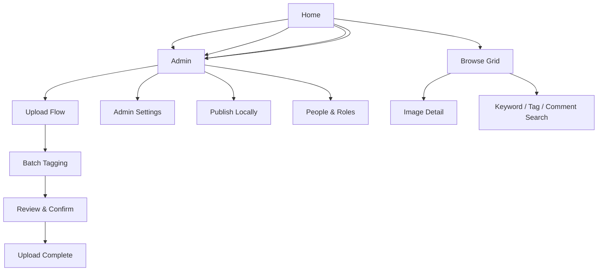
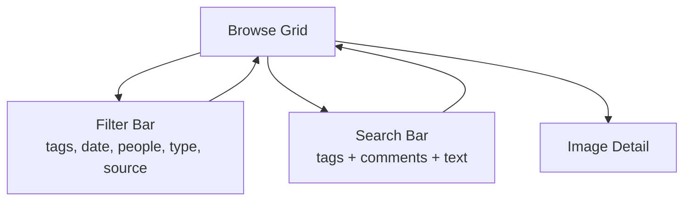
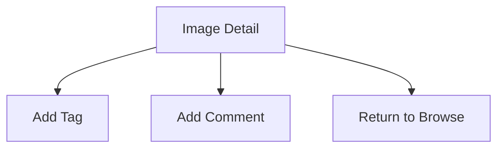
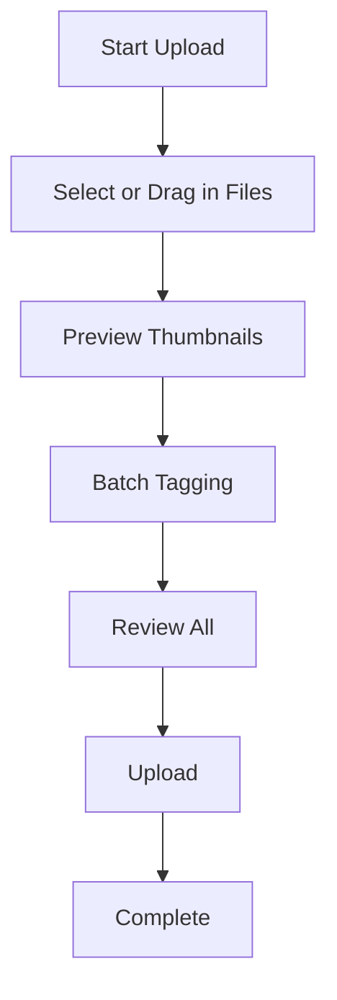
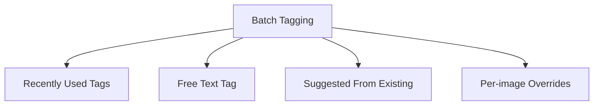
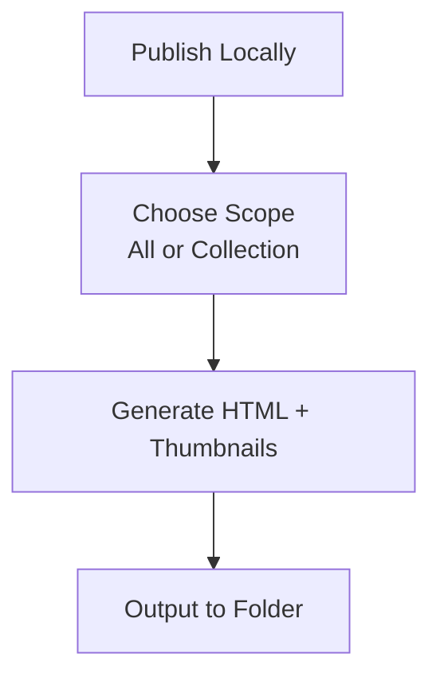
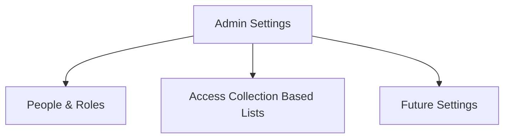

# UI Flows

This document describes the user flows for the first version of the Image Management System.  
The goal is to keep the experience simple, clear and friendly for both admins and casual viewers.

Version one focuses on browsing, simple search, uploading, batch tagging and a basic publish flow.

---

## 1. High-level navigation

---

## 2. Home

### Actions
- Browse all images  
- Use the collection dropdown (defaults to "All")  
- Upload (admin only)  
- Publish (admin only)  

Light and simple.

---

## 3. Browse flow

### Notes
- Original aspect ratio thumbnails  
- Multi-select filters  
- Search supports:  
  - tags  
  - comments  
  - all text fields  

---

## 4. Image detail flow

### Notes
- Admins can tag + comment  
- Casuals browse only  
- EXIF hidden behind toggle  

---

## 5. Upload flow (admin)

---

## 6. Batch tagging flow

---

## 7. Publish locally

---

## 8. Admin settings (UI only)

---

## V1 Simplicity Notes

- No favourites  
- No albums  
- No moderation workflow  
- Comments + tags only for admins  
- EXIF hidden  
- Access settings are UI-only  
- Publish flow is single-step  